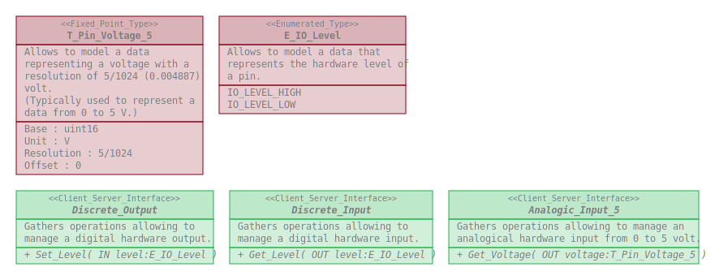

# Hardware_IO_Interfaces

This repository defines a package gathering software elements allowing to manage
input and output pins of an hardware device.

## Content

The Hardware_IO_Interfaces package gathers :
* Types :
  * T_Pin_Voltage_5
  * E_IO_Level
* Client_Server_Interfaces :
  * Analog_Input_5
  * Digital_Input
  * Digital_Output
  
## Overview

## Dependencies

None.

## Use

### With the Arduino IDE

This repository shall be clone within the _librairies_ folder of the _Arduino
sketchbook folder_.